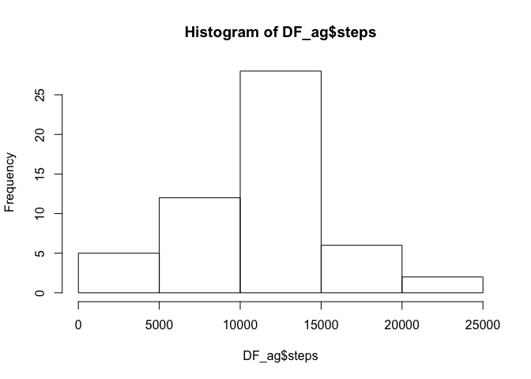
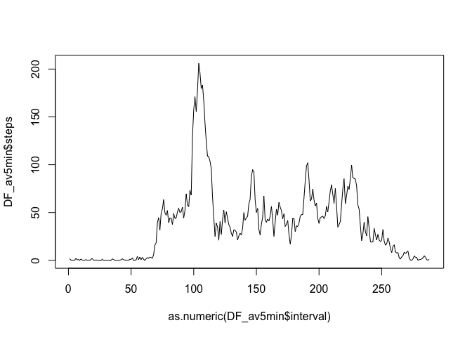
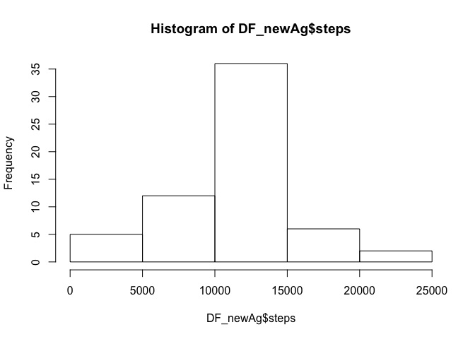
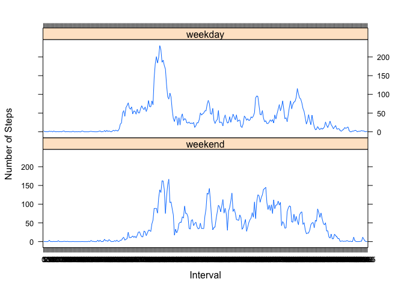

# Reproducible Research: Peer Assessment 1


## Loading and preprocessing the data
The dataset was read into a dataframe called DF. str was called to check the column classes and date column reclassed accordingly.


```r
DF<- read.csv("activity.csv", header=TRUE)
DF$date <- as.POSIXct(DF$date)
```


## What is mean total number of steps taken per day?

The 'steps' variable was aggregated over the daily timestep using the aggregate function in core R. NA values were ignored here.
A histogram of the daily values was created.
The mean 'mean_steps' was then calculated as: sum of daily steps total divided by number of days. 

The mean total number of steps taken is 10767, and the median is 10766


```r
DF_ag <- aggregate(steps ~ date, DF, sum, na.omit=TRUE)
hist(DF_ag$steps)
```



```r
mean_steps <- sum(DF_ag[,2]) %/% length(DF_ag[,2])
mean_steps
```

```
## [1] 10767
```

```r
median_steps <- median(DF_ag$steps)
median_steps
```

```
## [1] 10766
```

## What is the average daily activity pattern?

The average number of steps per 5 min interval was calculated using the aggregate function.
The timeseries was plotted and the most active 5 minute period on average was found as 206.2, at the 104th time interval (835 minutes).


```r
DF$interval <- as.factor(DF$interval)
DF_av5min <- aggregate(steps ~ interval, DF, mean, na.omit=TRUE)
plot(DF_av5min$steps ~ as.numeric(DF_av5min$interval) , type = "l")
```



```r
highest<-max(DF_av5min$steps)
highest
```

```
## [1] 206.1698
```

```r
DF_av5min[which(DF_av5min$steps==highest),]
```

```
##     interval    steps
## 104      835 206.1698
```


## Imputing missing values
The number of missing values were found to be 2304. The dataframes were joined (using the plyr package) after renaming the 5 minute average steps column. The new dataframe with imputed step values is called DF_new.
The imputed values made very little change to the mean and no change to the median value.


```r
missing <- is.na(DF$steps)
sum(missing)
```

```
## [1] 2304
```

```r
names(DF_av5min)[2]<-"steps_5minAv"
require(plyr)
```

```
## Loading required package: plyr
```

```r
DF_temp <- join(DF,DF_av5min, type = "left", match = "all")
```

```
## Joining by: interval
```

```r
DF_temp$steps[missing]<-DF_temp$steps_5minAv[missing]
DF_new <- DF_temp[,1:3]

DF_newAg <- aggregate(steps ~ date, DF_new, sum)
hist(DF_newAg$steps)
```



```r
mean_steps_new <- sum(DF_newAg[,2]) %/% length(DF_newAg[,2])
mean_steps_new
```

```
## [1] 10766
```

```r
median_steps_new <- median(DF_ag$steps)
median_steps_new
```

```
## [1] 10766
```

## Are there differences in activity patterns between weekdays and weekends?
Create a vector of weekdays for boolean test. Group the DF by weekday/weekend, and by interval (factor) and take the mean #steps over each interval for each type of day. PLot using lattice.


```r
WDs <- c('Monday', 'Tuesday', 'Wednesday', 'Thursday', 'Friday')
DF_new$wDay <- factor((weekdays(DF_new$date) %in% WDs), 
                   levels=c(FALSE, TRUE), labels=c('weekend', 'weekday')) 

require(dplyr)
```

```
## Loading required package: dplyr
```

```
## Warning: package 'dplyr' was built under R version 3.1.3
```

```
## 
## Attaching package: 'dplyr'
```

```
## The following objects are masked from 'package:plyr':
## 
##     arrange, count, desc, failwith, id, mutate, rename, summarise,
##     summarize
```

```
## The following objects are masked from 'package:stats':
## 
##     filter, lag
```

```
## The following objects are masked from 'package:base':
## 
##     intersect, setdiff, setequal, union
```

```r
DF_final<-DF_new %>% group_by(wDay,interval) %>% summarise(AverageSteps = mean(steps))

require(lattice)
```

```
## Loading required package: lattice
```

```r
with(DF_final, (xyplot(AverageSteps~interval|factor(wDay),
       type='l',layout=c(1,2),
       xlab='Interval',ylab='Number of Steps')))
```


